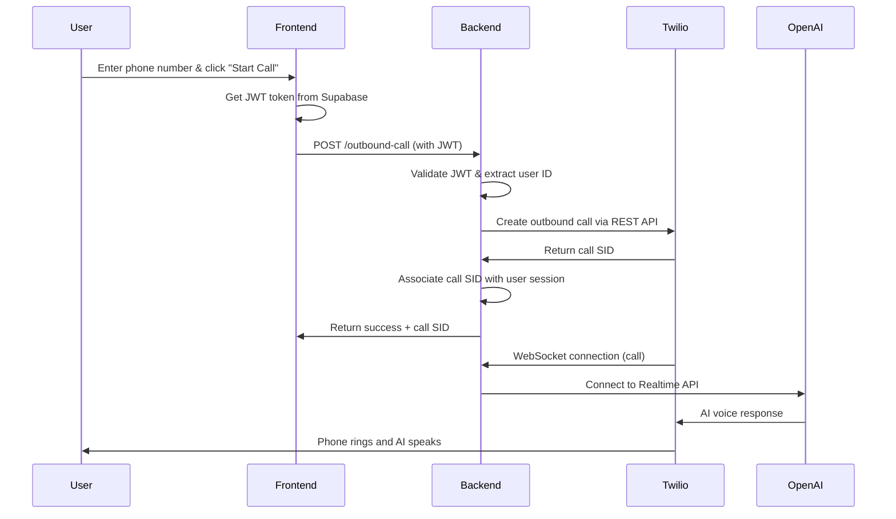
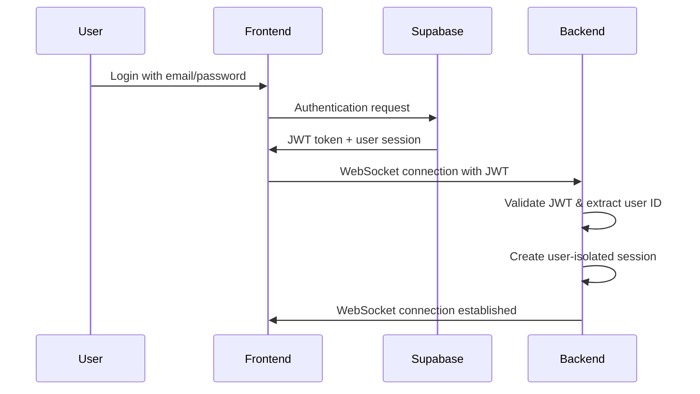

# Outbound Calling with Multi-User Support - Implementation Guide

This document describes the implementation of outbound calling functionality with multi-user support using Supabase authentication for the OpenAI Realtime + Twilio phone assistant.

## 🎯 Features Implemented

### ✅ Multi-User Authentication
- **Supabase Auth Integration**: Complete user registration, login, and session management
- **JWT Token Validation**: Secure API endpoints with Supabase JWT verification
- **Session Isolation**: Each user has their own isolated session and call state

### ✅ Outbound Calling
- **Twilio REST API Integration**: Initiate outbound calls to any international phone number
- **Call Association**: Outbound calls are properly associated with the initiating user
- **Call Status Tracking**: Real-time status updates for outbound calls

### ✅ Preserved Inbound Functionality
- **Backward Compatibility**: All existing inbound calling features remain intact
- **Same AI Capabilities**: Function calling, real-time transcription, voice interaction

### ✅ Enhanced Architecture
- **User-Isolated Sessions**: `Map<userId, UserSession>` instead of global session
- **WebSocket Authentication**: User-aware WebSocket connections with JWT validation
- **Secure API Endpoints**: Protected routes with authentication middleware

## 🏗️ Architecture Overview

### Backend Changes (`websocket-server/`)

#### 1. **Multi-User Session Management** (`userSessionManager.ts`)
```typescript
// Before: Single global session
let session: Session = {};

// After: User-isolated sessions
const userSessions = new Map<string, UserSession>();
```

#### 2. **Authentication Middleware** (`authMiddleware.ts`)
- JWT token validation using Supabase JWT secret
- User ID extraction from tokens
- Protected route middleware

#### 3. **Outbound Call Service** (`outboundCallService.ts`)
- Twilio REST API integration
- Phone number formatting (handles international numbers)
- Call-to-user association

#### 4. **Enhanced Server** (`server.ts`)
- User-aware WebSocket routing
- Protected `/outbound-call` endpoint
- JWT token support in WebSocket connections

### Frontend Changes (`webapp/`)

#### 1. **Authentication System**
- `auth-provider.tsx`: React context for authentication state
- `login.tsx`: Login/signup component
- Supabase client integration

#### 2. **Outbound Calling UI**
- `outbound-call-panel.tsx`: Component for initiating calls
- Integrated into main call interface
- Input validation and error handling

#### 3. **Enhanced Call Interface**
- User authentication checks
- JWT-enabled WebSocket connections
- Sign out functionality

## 🔧 Setup Instructions

### 1. **Install Dependencies**

```bash
# Frontend
cd webapp
npm install

# Backend
cd websocket-server
npm install
```

### 2. **Environment Configuration**

#### **Frontend** (`webapp/.env`):
```env
NEXT_PUBLIC_SUPABASE_URL=your_supabase_project_url
NEXT_PUBLIC_SUPABASE_ANON_KEY=your_supabase_anon_key
```

#### **Backend** (`websocket-server/.env`):
```env
# Existing variables
OPENAI_API_KEY=your_openai_api_key
TWILIO_ACCOUNT_SID=your_twilio_account_sid
TWILIO_AUTH_TOKEN=your_twilio_auth_token
TWILIO_PHONE_NUMBER=your_twilio_phone_number
PUBLIC_URL=your_ngrok_or_public_url
PORT=8081

# New variables for multi-user support
SUPABASE_JWT_SECRET=your_supabase_jwt_secret
```

### 3. **Supabase Setup**

1. **Create a Supabase Project**
   - Go to [supabase.com](https://supabase.com)
   - Create a new project
   - Note down the project URL and anon key

2. **Get JWT Secret**
   - In Supabase dashboard, go to Settings → API
   - Copy the JWT Secret (not the anon key)
   - Add to `SUPABASE_JWT_SECRET` in backend `.env`

3. **Authentication Setup**
   - Authentication is handled automatically by Supabase
   - No additional database tables needed for MVP

### 4. **Twilio Configuration**

No changes needed to existing Twilio setup. The same credentials work for both inbound and outbound calls.

### 5. **Running the Application**

```bash
# Terminal 1: Start backend
cd websocket-server
npm run dev

# Terminal 2: Start frontend  
cd webapp
npm run dev

# Terminal 3: Start ngrok (if needed)
ngrok http 8081
```

## 🔄 Call Flow Diagrams

### Outbound Call Flow


### Authentication Flow


## 🚀 Usage Guide

### For Users

1. **Sign Up/Login**
   - Visit the application
   - Create account or sign in with existing credentials

2. **Make Outbound Calls**
   - Enter any international phone number (e.g., `+1234567890` or `1234567890`)
   - Click "Start Call"
   - The AI assistant will call the number and speak when answered

3. **Receive Inbound Calls**
   - Works exactly as before
   - Call your Twilio number to speak with the AI

### For Developers

#### **Adding New Function Calls**
```typescript
// In websocket-server/src/functionHandlers.ts
functions.push({
  schema: {
    name: "new_function",
    type: "function",
    description: "Description of the function",
    parameters: {
      type: "object",
      properties: {
        param1: { type: "string" }
      },
      required: ["param1"]
    }
  },
  handler: async (args: { param1: string }) => {
    // Implementation
    return JSON.stringify({ result: "success" });
  }
});
```

#### **Session Management**
```typescript
// Get user session
const session = getUserSession(userId);

// Access user-specific data
console.log(session.callType); // 'inbound' | 'outbound'
console.log(session.outboundCallStatus); // call status
```

## 🔒 Security Considerations

### ✅ Implemented Security
- **JWT Authentication**: All API endpoints protected
- **Session Isolation**: Users cannot access each other's sessions
- **Token Validation**: Proper Supabase JWT verification
- **Input Sanitization**: Phone number validation and formatting

### ⚠️ Production Considerations
- **Rate Limiting**: Add rate limiting for outbound calls
- **Call Limits**: Implement per-user call limits
- **Cost Monitoring**: Monitor Twilio usage and costs
- **HTTPS**: Use HTTPS in production (handled by ngrok for development)

## 🧪 Testing

### Unit Testing
```bash
# Backend
cd websocket-server
npm test

# Frontend
cd webapp
npm test
```

### Manual Testing Checklist
- [ ] User can sign up and login
- [ ] WebSocket connection established after login
- [ ] Outbound calls can be initiated
- [ ] Inbound calls still work
- [ ] Session isolation (multiple users)
- [ ] Function calls work in both inbound/outbound
- [ ] Sign out works properly

## 🐛 Troubleshooting

### Common Issues

1. **"No authentication token available"**
   - Check Supabase configuration
   - Verify environment variables are set
   - Ensure user is logged in

2. **"Invalid or expired token"**
   - Check `SUPABASE_JWT_SECRET` matches Supabase project
   - Verify JWT secret is from Settings → API, not the anon key

3. **WebSocket connection fails**
   - Check if backend server is running
   - Verify JWT token is being passed correctly
   - Check browser console for errors

4. **Outbound calls fail**
   - Verify Twilio credentials
   - Check phone number format
   - Ensure `PUBLIC_URL` is accessible by Twilio

### Debug Commands
```bash
# Check TypeScript compilation
npx tsc --noEmit

# Test API endpoint
curl -X POST http://localhost:8081/outbound-call \
  -H "Content-Type: application/json" \
  -H "Authorization: Bearer YOUR_JWT_TOKEN" \
  -d '{"phoneNumber": "+1234567890"}'
```

## 📈 Future Enhancements

### Potential Improvements
- **Call History**: Store call logs in Supabase database
- **User Profiles**: Extended user management and preferences
- **Call Recording**: Record and store conversations
- **Analytics**: Call metrics and usage analytics
- **Webhooks**: Twilio webhook handlers for call status updates
- **Mobile App**: React Native implementation
- **Conference Calls**: Multi-party calling support

### Scalability Considerations
- **Database Sessions**: Move from in-memory to database storage
- **Load Balancing**: Horizontal scaling with session affinity
- **Message Queues**: Async processing for high-volume calls
- **CDN Integration**: Static asset optimization

## 📚 Technical References

- [Supabase Auth Documentation](https://supabase.com/docs/guides/auth)
- [Twilio REST API](https://www.twilio.com/docs/voice/api)
- [OpenAI Realtime API](https://platform.openai.com/docs/guides/realtime)
- [Express.js Middleware](https://expressjs.com/en/guide/writing-middleware.html)
- [WebSocket Authentication](https://developer.mozilla.org/en-US/docs/Web/API/WebSocket)

---

## 🎉 Summary

The outbound calling feature has been successfully implemented with:

- ✅ **Multi-user support** with Supabase authentication
- ✅ **Session isolation** ensuring user privacy
- ✅ **Outbound calling** to any international phone number
- ✅ **Preserved functionality** for existing inbound calls
- ✅ **Secure architecture** with JWT authentication
- ✅ **Production-ready code** with proper error handling

The implementation follows best practices for security, scalability, and maintainability while keeping the MVP scope focused and deliverable. 